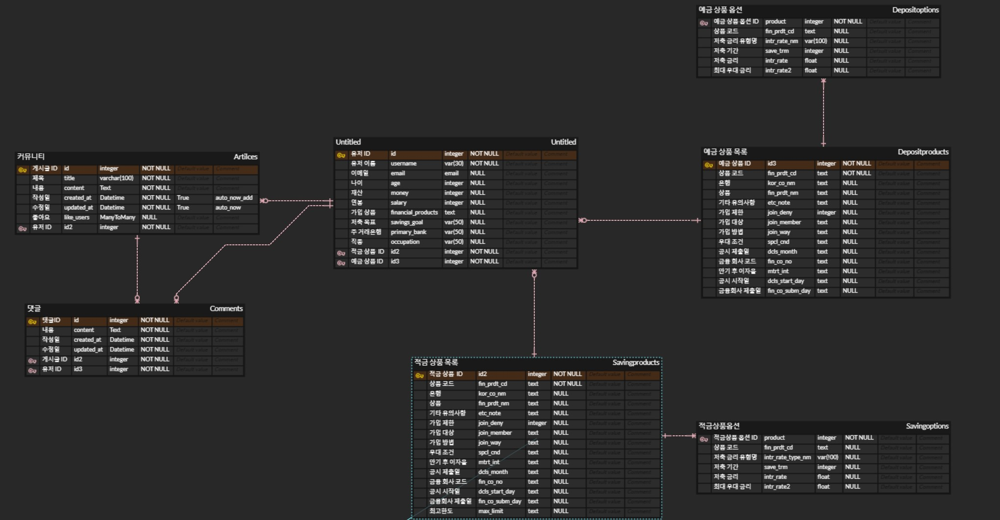

1\. 팀원 정보 및 업무 분담 내역
 

**김경범**

-   **사이트 디자인 및 CSS** : 웹사이트의 전반적인 디자인 및 스타일링을 담당하며 사용자 경험을 향상시키기 위해 시각적인 측면을 담당
-   **예적금 상품 조회 및 상세 조회** : 예적금 상품에 대한 기본 조회 및 상세 정보를 효과적으로 구현하여 사용자가 필요한 정보 조회
-   **회원 커스터마이징**: 사용자 개별의 요구사항이나 환경에 맞게 웹사이트를 사용자가 쉽게 조작하고 개인화할 수 있도록 구현
-   **회원 커스터마이징**: 사용자 개별의 요구사항이나 환경에 맞게 웹사이트를 사용자가 쉽게 조작하고 개인화할 수 있도록 구현

**이현직**

-   **로고 디자인, 홈페이지 디자인 및 CSS**: 웹사이트의 로고 및 전반적인 홈페이지 디자인과 스타일링을 담당하여 브랜딩 및 사용자 시각적인 효과를 담당
-   **커뮤니티 기능 구현**: 사용자 간 소통을 위한 커뮤니티 기능을 구현하여 정보 교류와 사용자 간 상호 작용을 담당
-   **카카오 맵으로 가까운 은행 검색 기능 구현**: 지도 서비스를 이용하여 사용자의 위치를 기반으로 가까운 은행을 찾을 수 있는 기능을 구현

**조수현**

-   **환율 계산기 기능 구현**: 사용자가 간편하게 환율을 계산할 수 있는 기능을 구현하여 다양한 편의 기능을 제공
-   **회원 정보 수정, 비밀번호 변경, 회원 탈퇴 기능 구현**: 사용자의 프로필 및 계정에 대한 핵심적인 기능을 구현하여 회원이 자유롭게 정보를 관리하고 보안적인 측면에서도 안전한 서비스를 제공
-   **CSS 수정**: 전반적인 웹사이트의 스타일링을 개선하기 위해 CSS 수정을 수행하여 사용자에게 더 나은 시각적 경험을 제공

 

|   | 11/16(목) | 11/17(금) | 11/18(토) | 11/19(일) | 11/20(월)  | 11/21(화) | 11/22(수) | 11/23(목) |
| --- | --- | --- | --- | --- | --- | --- | --- | --- |
| 김경범 | 프로젝트 기획 및 화면 구성, API 연결 테스트, ERD 작성 |  회원가입 화면 구성, 로그인, 로그아웃 기능 구현 |회원 정보 수정 화면 구현, 회원정보 및 비밀번호 변경 화면 구현  |  회원정보 마이페이지 화면 수정 및 알고리즘 수정 | 회원 정보 수정 화면 구성 추가 | 예적금리스트 조회 화면 구현 및 조회 최고금리순, 기본금리순 알고리즘 구현   | 예적금리스트 저축기간별 최고금리순, 기본금리순 알고리즘, 은행선택별 최고금리순, 기본금리순 알고리즘 구현, 화면 상세페이지 구현  |  예적금리스트과 관심상품기능 충돌 해결, , 상세 및 조회 페이지 디자인 수정, 주변은행찾기, 게시글 조회, 게시글 상세페이지, 댓글 등 사이트 전반적인 화면디자인 개선, 메인페이지 애니메이션 추가 및 구성 |
| 이현직 | 카카오 오븐을 이용해 로그인, 회원가입, 환율 계산기, 지도 페이지 디자인 | 커뮤니티 생성, 삭제 기능 구현 | 커뮤니티 상세 정보 기능 구현 | 커뮤니티 수정 기능 구현 | 댓글 생성, 삭제 기능 구현 | 댓글 수정 기능 구현, 게시글 좋아요 기능 구현 | 상품 가입하기 기능 구현, 게시판 CSS 작업 | 앱 로고 디자인 생성, 기능 작동 확인, 메인 페이지 디자인 |
| 조수현 | ERD 작성, 장고 모델링, CRUD 구현 | 환율 계산기 만들기, 예적금 데이터 저장하기 | ERD 수정, 좋아요 기능 추가, 회원가입, 로그인 구현 | 커스텀 유저 모델 생성 밒 유저 모델 수정 기능 | 유저 수정하기, 카카오맵(근처 은행 찾기) 기능 | 필요한 에셋들 다운로드, 기본 디자인 구상 | 지도, 계산기 디자인, 날짜 라이브러리 적용, 본인이 작성한 글, 댓글만 삭제하도록 구현 | 장바구니 기능, 상품 추천하기 기능 구현, CSS 다듬기  |

2\. 설계 내용(아키텍쳐 등) 및 설계 구현 정도
 

**기술 스택 및 도구**:

-   Frontend: Vue3
-   Backend: DRF

설계 내용

#### 1\. 예적금 금리 비교

-   **기능 명세 및 설계 :** 예적금 상품 정보를 다양한 은행에서 제공하고, 사용자가 원하는 상품을 선택하여 비교할 수 있는 기능을 개발합니다.
-   **페이지 및 화면 설계**: 예적금 목록 페이지에서 각 은행의 상품을 카드 형태로 표시하고, 사용자가 버튼을 통해 원하는 상품을 담을 수 있도록 설계합니다
-   **알고리즘 및 로직 설계 :** 상품 비교는 사용자가 선택한 기준에 따라 정렬되며, 최대 우대 금리가 높은 순으로 내림차순 정렬됩니다.

#### 2\. 환율 계산기

-   **기능 명세 및 설계 :** 사용자가 환율을 계산할 수 있는 간편한 도구를 제공합니다.
-   **페이지 및 화면 설계 :** 환율 계산 페이지에서 사용자가 기존 화폐와 변환하고자 하는 화폐를 선택하고, 계산 버튼을 클릭하여 결과를 확인할 수 있는 인터페이스를 설계합니다.
-   **알고리즘 및 로직 설계 :** 환율 정보는 외부 API를 통해 실시간으로 가져오며, 사용자의 입력에 따라 계산되어 화면에 표시됩니다.

#### 3 . 근처 은행 검색

-   **기능 명세 및 설계 :** 현재 위치와 은행 종류를 기반으로 근처 은행을 검색할 수 있는 기능을 개발합니다.
-   **페이지 및 화면 설계** : 지도를 활용하여 사용자의 현재 위치 주변에 있는 은행 위치를 마커로 표시하고, 은행 목록을 나열하는 페이지를 설계합니다.
-   **알고리즘 및 로직 설계** : Kakao Maps API를 이용하여 현재 위치에서 가까운 은행 위치를 검색하고 표시합니다.

#### 4\. 커뮤니티 (게시판)

-   **기능 명세 및 설계 :** 회원들 간의 소통과 예적금 상품에 대한 정보 공유를 위한 게시판을 개발합니다.
-   **페이지 및 화면 설계 :** 게시판 페이지에서 사용자들이 글을 작성하고 댓글을 남길 수 있는 인터페이스를 설계합니다.

#### 5\. 프로필 페이지 (금융상품 추천 알고리즘)

-   **기능 명세 및 설계** : 내가 가입한 정보를 기반으로 한 금융 상품 추천을 받을 수 있는 페이지를 제공합니다.
-   **페이지 및 화면 설계** : 사용자 프로필 페이지에서 추천 상품 목록과 가입한 상품을 편리하게 확인할 수 있는 인터페이스를 설계합니다.
-   **알고리즘 및 로직 설계** : 사용자의 정보를 기반으로 한 추천 알고리즘을 통해 최적의 상품을 제시하며, 가입한 상품 목록을 조회할 수 있도록 구현합니다.

3\. 데이터베이스 모델링(ERD)
 

4\. 금융 상품 추천 알고리즘에 대한 기술적 설명
 

1\. **사용자 입력 수집**:

-   사용자가 회원가입 시 입력한 정보(주 거래 은행, 가입 상품, 저축 기간 등)은 axios를 사용하여 Django 서버로 안전하게 전송됩니다.

2\. **데이터베이스 필터링 및 정렬**:

-   서버에서 전달받은 정보를 기반으로 예적금 데이터베이스에서 필터링을 수행합니다.
-   최대 우대 금리를 기준으로 한 내림차순 정렬을 수행하여 사용자에게 가장 이익이 되는 상품을 상위에 배치합니다.

3\. **상품 필터링**:

-   사용자가 이미 가입한 상품은 필터링하여 중복 제거합니다.
-   사용자가 선택한 저축 기간에 해당하는 상품만을 고려합니다.

4\. **주거래 은행 기반 필터링**:

-   사용자가 지정한 주 거래 은행에 해당하는 상품을 필터링합니다.
-   주거래 은행에 해당하는 상품이 존재하면 이를 사용자에게 제시하고, 그렇지 않은 경우에는 이전 단계에서 필터링한 내역에서 상위 3개의 상품을 추천합니다.

5\. 서비스 대표 기능들에 대한 설명

1) **예적금 금리 비교**

-   다양한 은행들의 예적금 상품 정보를 제공합니다.
-   원하는 상품을 버튼을 통해 비교함으로써 각 은행의 금리를 쉽게 확인할 수 있습니다.

2) **환율 계산기**

-   사용자가 원하는 환율을 계산할 수 있는 도구를 제공합니다.
-   간편한 인터페이스를 통해 실시간 환율 정보를 확인하고 계산할 수 있습니다.

3) **근처 은행 검색**

-   현재 위치와 은행 종류를 기반으로 근처 은행을 검색할 수 있습니다.
-   지도와 연동하여 사용자에게 가장 편리한 은행 위치를 찾을 수 있습니다.

4) **커뮤니티 (게시판)**

-   회원 간의 소통과 예적금 상품 정보 공유를 위한 게시판을 운영합니다.
-   다양한 주제로 금융에 관련된 정보를 나눌 수 있는 플랫폼을 제공합니다.

5) **프로필 페이지 (금융상품 추천 알고리즘)**

-   내가 가입한 정보를 기반으로 한 금융 상품 추천을 받을 수 있는 페이지를 제공합니다.
-   가입한 상품을 손쉽게 확인하고 관리할 수 있는 기능을 제공하며, 회원 개인정보를 쉽게 등록, 수정, 비밀번호 변경이 가능합니다.

6\. 기타(느낀점, 후기 등)

\- 김경범 :
  웹서비스의 기획부터 완성까지 짧은 시간이었지만 모든 단계를 거치는 경험을 얻었다는것이 너무 좋았다
이를 통해서 백엔드와 프론트엔드에서 어떠한 역할이 구체적으로 있는지 알 수 있었다 특히나 프론트엔드의 역할이 단순히 보여지는 화면 뿐만아니라 이를 동적으로 효과적으로 보여주고, 로딩시간을 최적화 하기 위해 다양한 알고리즘을 활용한다는 것을 알게 되었다
화면 디자인의 중요성을 알게되었다
단순히 이쁘게 보이는 것이 중요한 것이 아니라, 이용자에게 어떻게하면 중요하고 핵심적인 정보를 효과적으로 전달 할 수 있을지, 어떻게 배치하는 것이 이용자에게 편안한 화면을 제공할지에 대해 고민 할 수 있는 시간이었다
 

UX 의 중요성에 대해 알게 되었다
로그인 기능에 오직 로그인 버튼 클릭을 할 때에만 로그인이 되도록 하였었는데 평소에 엔터를 통해 로그인을 하는 습관이 있어 이러한 사소한 부분에서 부터 불편함을 느끼고 사용자의 경험에 대해 중요성을 느끼게 되었다
여러 번의 테스팅을 겪으며 이용자의 입장에서 어떻게 버튼을 누르고, 어디에 버튼이 있어야 하며 이러한 상황에서는 이용자가 이러한 선택을 할 수 있을텐데 이럴 때 에러는 나지 않는지 많은 상황을 확인해 보았다
아무리 좋은 디자인과 좋은 정보들이 들어있는 웹서비스를 제공한다하더라도 이용자가 불편함을 느낀다면 대체재가 나타나게 되었을 때 경쟁력이 떨어질 위험이 크다
따라서 이용자에게 맞춤 UI와 UX를 제공하는것이 큰 핵심임을 알 수 있었다

\- 이현직 :
처음 진행해보는 프로젝트였기에 목표 설정부터 구체적인 기획, 실제 구현까지  예상한 것처럼 수월하게 진행되지는 않았습니다.
 하지만 프로젝트를 진행하면서 이전에 배웠던 부분들에 대해 한번 더 복습하고, 응용하는 코드를 작성해 보면서 헷갈렸던 부분에 대해서도 제대로 이해하고 코드를 사용할 수 있게 됐습니다. 
 코딩으로 하는 첫 프로젝트인 만큼 
 기획을 할 때에는 의견을 많이 내는 것이 중요하다는 것을 느꼈고, 각자의 진행 상황들을 다른 팀원들에게 정확히 말해주어 소통을 원할히 하는 것이 중요하다는 것을 알게 되었습니다. 
 코드를 작성할 때에는 변수 명 작성을 통일하고 이해하도록 쓰는 것이 중요하다고 느꼈고, 시간 날 때마다 팀원들의 결과물들을 merge 하여 충돌을 방지하도록 하는 것도 중요하다고 느꼈습니다.  
  
 이번 프로젝트에서 front 부분을 맡으며 디자인을 해보고 팀원들과의 소통을 통해 디자인과 기능 부분이 조금씩 더 발전해 나가는 것을 보면서, 팀원들과 협업하여 결과물을 만들어 낸다는 것에 대해 뿌듯함을 느꼈습니다.
 이번 경험을 살려 2학기 프로젝트에는 시행착오를 덜 할 수 있도록 하겠습니다.

\- 조수현 :

4개월간의 학습을 토대로 처음으로 장고로 모델을 구성하고 데이터를 받아와서 뷰에서 화면을 구성하는 완성된 프로젝트를 만들어봤습니다. 관통 프로젝트를 진행하면서 시간이 부족하다는 느낌과 완성이 아직 미흡하다는 아쉬움을 느꼈지만, 다양한 기능을 추가하고 화면을 구성하는 것이 신기하게 느껴졌습니다.
프로젝트 진행 중에는 머지 과정에서 데이터 손실이 발생하거나 로직을 구성하다가 에러에 마주치고, 데이터가 수정되지 않아 모델과 시리얼라이저를 다시 고쳐야 했던 어려움도 있었습니다. 하지만 이러한 어려움을 해결하는 방법을 찾아가며 여러 경험을 쌓을 수 있었습니다.
팀원들과의 협업을 통해 프로젝트를 완성해 나가는 경험도 중요하게 느껴졌습니다. 힘들 때마다 팀원들이 용기를 북돋아주어 프로젝트를 마무리할 수 있었습니다.
깃 사용법의 중요성과 커밋 메시지 작성의 중요성을 깨달았습니다. 또한, 프로젝트를 진행하기 위해서는 지식의 확장이 필요하다는 것을 깨달아 더 많은 공부가 필요하다는 느낌을 받았습니다.
이번 프로젝트를 통해 얻은 경험과 깨달음을 바탕으로 2학기에는 더 풍부하고 완성도 높은 프로젝트를 선보이고 싶습니다.